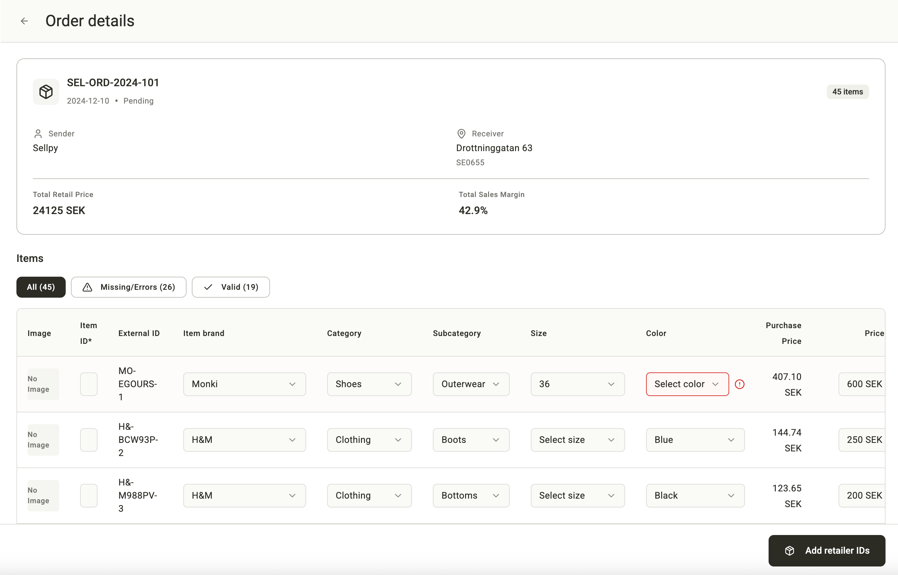
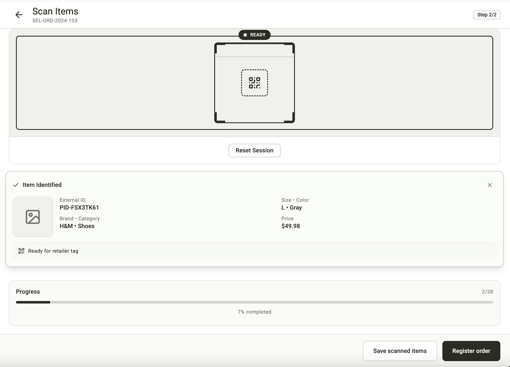

# Order and Delivery Flows - Backend Implementation Guide

This document describes the critical flows for Sellpy and Thrifted orders from creation to inbound boxes in store, including required endpoints and validation rules for backend implementation.

---

## A) Sellpy Order and Delivery Flow

### Overview
Sellpy orders are created via API integration. The flow includes a mandatory retailer ID scanning step before registration, and requires all items to have retailer IDs before creating delivery notes.

### Flow Stages

#### Stage 1: Order Creation (API Integration)
**Status**: `pending`

1. **Order Creation via API**
   - Orders are created automatically from Sellpy's system
   - Items come pre-populated with basic information
   - Some items may have validation errors that need fixing
   - Items do NOT have retailer IDs initially

**Required Endpoint:**
```
POST /api/orders/sellpy
```

**Request Body:**
```json
{
  "externalOrderId": "string (required)",
  "partnerId": "string (required - Sellpy Operations)",
  "warehouseId": "string (required)",
  "receivingStoreId": "string (required)",
  "items": [
    {
      "itemId": "string (required)",
      "brand": "string (optional - may be missing)",
      "gender": "string (optional)",
      "category": "string (optional - may be missing)",
      "subcategory": "string (optional)",
      "size": "string (optional - may be missing)",
      "color": "string (optional - may be missing)",
      "price": "number (required, > 0, ≤ 99,999 SEK)",
      "purchasePrice": "number (required, > 0)",
      "retailerItemId": "string (optional - typically missing initially)"
    }
  ]
}
```

**Validation Rules:**
- `externalOrderId`: Required, must be unique
- `partnerId`: Must be "Sellpy Operations" partner ID
- `warehouseId`: Must exist in system
- `receivingStoreId`: Must exist in system
- `items`: Array, minimum 1 item required
- Each item:
  - `itemId`: Required, unique within order
  - `price`: Required, must be > 0 and ≤ 99,999 SEK
  - `purchasePrice`: Required, must be > 0
  - Other fields may be missing (will cause validation errors)

**Response:**
```json
{
  "orderId": "string",
  "status": "pending",
  "createdDate": "ISO 8601 date string",
  "totalItems": "number",
  "itemsWithRetailerIds": 0,
  "validationErrors": [
    {
      "itemId": "string",
      "field": "string",
      "message": "string"
    }
  ]
}
```

**Suggested Screen to Review:**

**Screenshot 1.1: ShippingScreen - Orders Tab (Pending Sellpy Orders)**

*Screen: `ShippingScreen.tsx` - "Orders" tab showing pending Sellpy orders*

**Screenshot 1.2: OrderDetailsScreen - Order Details with Items**

*Screen: `OrderDetailsScreen.tsx` - Shows order details with items needing retailer IDs*

---

#### Stage 2: Fix Validation Errors (Optional)
**Status**: `pending`

1. **Edit Items with Errors**
   - Users can edit items that have validation errors
   - Must fix all required fields before proceeding

**Required Endpoint:**
```
PATCH /api/orders/{orderId}/items/{itemId}
```

**Request Body:**
```json
{
  "brand": "string (required if missing)",
  "category": "string (required if missing)",
  "size": "string (required if missing)",
  "color": "string (required if missing)",
  "price": "number (required if invalid)"
}
```

**Validation Rules:**
- `brand`: Must match valid brand list (H&M, WEEKDAY, COS, Monki, etc.)
- `category`: Must match valid category list (Clothing, Shoes, Accessories)
- `subcategory`: Must be valid for selected category
- `size`: Must match valid size list (XS-XXL, 28-46)
- `color`: Must match valid color list
- `price`: Must be > 0 and ≤ 99,999 SEK

**Response:**
```json
{
  "itemId": "string",
  "status": "valid" | "error",
  "errors": ["string"]
}
```

**Suggested Screen to Review:**

**Screenshot 2.1: OrderDetailsScreen - Items with Error Status**

*Screen: `OrderDetailsScreen.tsx` - Shows items with error status and edit functionality*

---

#### Stage 3: Add Retailer IDs (Scanning Flow)
**Status**: `pending` → `in-progress`

1. **Navigate to Retailer ID Scan Screen**
   - User clicks "Add Retailer IDs" button
   - Opens scanning interface

2. **Scan Partner QR Code**
   - First scan: Partner QR code on item
   - Identifies which item to scan

3. **Scan Retailer Item ID**
   - Second scan: Retailer's barcode/QR code
   - Links retailer ID to partner item

4. **Repeat for All Items**
   - Continue until all items have retailer IDs
   - Can skip items and come back later

**Required Endpoint:**
```
POST /api/orders/{orderId}/items/{itemId}/retailer-id
```

**Request Body:**
```json
{
  "retailerItemId": "string (required)"
}
```

**Validation Rules:**
- `retailerItemId`: Required, must be unique across all items in the system
- Item must exist in order
- Order status must be `pending` or `in-progress`

**Response:**
```json
{
  "itemId": "string",
  "retailerItemId": "string",
  "itemsWithRetailerIds": "number",
  "totalItems": "number"
}
```

**Alternative Endpoint (Bulk Update):**
```
PATCH /api/orders/{orderId}/items/retailer-ids
```

**Request Body:**
```json
{
  "updates": [
    {
      "itemId": "string",
      "retailerItemId": "string"
    }
  ]
}
```

**Suggested Screen to Review:**

**Screenshot 3.1: RetailerIdScanScreen - Two-Step Scanning Process**

*Screen: `RetailerIdScanScreen.tsx` - Shows the two-step scanning process (Partner QR → Retailer ID)*

**Screenshot 3.2: OrderDetailsScreen - Progress of Items with Retailer IDs**

*Screen: `OrderDetailsScreen.tsx` - Shows progress of items with retailer IDs*

---

#### Stage 4: Register Order
**Status**: `in-progress` → `registered`

1. **Complete Order Registration**
   - All items must have retailer IDs
   - All validation errors must be fixed
   - User clicks "Register Order" button

**Required Endpoint:**
```
POST /api/orders/{orderId}/register
```

**Request Body:**
```json
{}
```

**Validation Rules:**
- Order status must be `pending` or `in-progress`
- All items must have `retailerItemId`
- All items must pass validation (no errors)
- At least 1 item required

**Response:**
```json
{
  "orderId": "string",
  "status": "registered",
  "registeredDate": "ISO 8601 date string"
}
```

**Suggested Screen to Review:**

**Screenshot 4.1: OrderDetailsScreen - Register Order Button**

*Screen: `OrderDetailsScreen.tsx` - Shows "Register Order" button and completion state*

**Screenshot 4.2: Post-Registration Dialog**

*Post-registration dialog appears after registration with options to create delivery note or view order list*

---

#### Stage 5: Create Delivery Note
**Status**: `registered`

1. **Create Delivery Note**
   - Can be done immediately after registration or later
   - Opens delivery note creation screen
   - Shows all items from the order

2. **Add Boxes**
   - Scan box labels (QR codes/barcodes) OR enter manually
   - Each box must have unique label
   - Boxes start with status `pending`

3. **Assign Items to Boxes**
   - Scan items into boxes OR select items and assign to box
   - Each item can only be in one box
   - Items must have retailer IDs (enforced)

4. **Register Boxes**
   - Mark boxes as `registered` when they contain items
   - Cannot register empty boxes

5. **Register Delivery Note**
   - All items must be assigned to boxes
   - At least one box must be registered
   - Creates delivery note with status `registered`

**Required Endpoint:**
```
POST /api/delivery-notes
```

**Request Body:**
```json
{
  "orderId": "string (required)",
  "boxes": [
    {
      "boxLabel": "string (required, unique)",
      "items": [
        {
          "itemId": "string (required)",
          "retailerItemId": "string (required)"
        }
      ]
    }
  ]
}
```

**Validation Rules:**
- `orderId`: Required, must exist, status must be `registered`
- `boxes`: Array, minimum 1 box required
- Each box:
  - `boxLabel`: Required, must be unique across all delivery notes
  - `items`: Array, minimum 1 item required for registered boxes
- All items from order must be included
- Each item must have `retailerItemId`
- No item can be in multiple boxes

**Response:**
```json
{
  "deliveryNoteId": "string",
  "status": "registered",
  "orderId": "string",
  "boxes": [
    {
      "boxId": "string",
      "boxLabel": "string",
      "itemCount": "number"
    }
  ],
  "createdDate": "ISO 8601 date string"
}
```

**Additional Endpoints:**

**Add Box:**
```
POST /api/delivery-notes/{deliveryNoteId}/boxes
```

**Assign Items to Box:**
```
POST /api/delivery-notes/{deliveryNoteId}/boxes/{boxId}/items
```

**Register Box:**
```
POST /api/delivery-notes/{deliveryNoteId}/boxes/{boxId}/register
```

**Suggested Screen to Review:**

**Screenshot 5.1: DeliveryNoteCreationScreen - Box Management**

*Screen: `DeliveryNoteCreationScreen.tsx` - Shows box management and item assignment*

**Screenshot 5.2: BoxManagementScreen - Alternative View**

*Screen: `BoxManagementScreen.tsx` - Alternative view for box management*

---

#### Stage 6: Shipment (Delivery Note Status Change)
**Status**: `registered` → `in-transit`

1. **Delivery Note Shipped**
   - When physical shipment occurs, delivery note status changes to `in-transit`
   - Can be done manually or via integration

**Required Endpoint:**
```
PATCH /api/delivery-notes/{deliveryNoteId}/ship
```

**Request Body:**
```json
{
  "shipmentDate": "ISO 8601 date string (optional)"
}
```

**Validation Rules:**
- Delivery note status must be `registered`
- All boxes must be registered
- All items must be assigned to boxes

**Response:**
```json
{
  "deliveryNoteId": "string",
  "status": "in-transit",
  "shipmentDate": "ISO 8601 date string"
}
```

**Suggested Screen to Review:**

**Screenshot 6.1: ShippingScreen - Shipments Tab**

*Screen: `ShippingScreen.tsx` - "Shipments" tab showing in-transit deliveries*

**Screenshot 6.2: OrderShipmentDetailsScreen - Delivery Note Details**

*Screen: `OrderShipmentDetailsScreen.tsx` - Shows delivery note details*

---

#### Stage 7: Receive at Store (Inbound Boxes)
**Status**: `in-transit` → `delivered`

1. **Store Staff Receives Delivery**
   - Delivery appears in "Inbound" tab for store staff
   - Shows list of boxes expected

2. **Scan Boxes**
   - Store staff scans box labels (QR codes/barcodes)
   - Boxes move from "Not scanned" to "Scanned" tab
   - Can scan individually or bulk mark as scanned

3. **Register Delivery**
   - When all boxes are scanned, can register delivery
   - Delivery status changes to `Delivered`
   - Boxes status changes to `Delivered`

**Required Endpoint:**
```
POST /api/deliveries/{deliveryId}/boxes/{boxId}/scan
```

**Request Body:**
```json
{
  "boxLabel": "string (required)"
}
```

**Validation Rules:**
- Delivery status must be `in-transit`
- Box label must match expected box in delivery
- Box must not already be scanned

**Response:**
```json
{
  "boxId": "string",
  "isScanned": true,
  "scannedDate": "ISO 8601 date string",
  "scannedBoxes": "number",
  "totalBoxes": "number"
}
```

**Register Delivery Endpoint:**
```
POST /api/deliveries/{deliveryId}/register
```

**Request Body:**
```json
{}
```

**Validation Rules:**
- All boxes must be scanned
- Delivery status must be `in-transit`

**Response:**
```json
{
  "deliveryId": "string",
  "status": "Delivered",
  "deliveredDate": "ISO 8601 date string"
}
```

**Alternative: Bulk Scan**
```
POST /api/deliveries/{deliveryId}/boxes/bulk-scan
```

**Request Body:**
```json
{
  "boxLabels": ["string"]
}
```

**Suggested Screen to Review:**

**Screenshot 7.1: ShippingScreen - Inbound Tab**

*Screen: `ShippingScreen.tsx` - "Inbound" tab for store staff*

**Screenshot 7.2: ReceiveDeliveryScreen - Scanning Interface**

*Screen: `ReceiveDeliveryScreen.tsx` - Shows scanning interface and box lists (Not scanned / Scanned tabs)*

---

### Sellpy Flow Summary

**Order Statuses:**
1. `pending` - Order created, items may have errors, no retailer IDs
2. `in-progress` - Some items have retailer IDs, scanning in progress
3. `registered` - All items have retailer IDs, ready for delivery note
4. `in-transit` - Delivery note created and shipped
5. `delivered` - Boxes received at store

**Key Differences from Thrifted:**
- Orders created via API (not manual)
- Mandatory retailer ID scanning step
- Items may have validation errors from API
- Cannot register order without all retailer IDs
- Cannot create delivery note without all retailer IDs

---

## B) Thrifted Order and Delivery Flow

### Overview
Thrifted orders are created manually by partner staff. Retailer IDs are entered directly (no scanning flow). Orders can be saved as pending or registered immediately.

### Flow Stages

#### Stage 1: Order Creation (Manual)
**Status**: `pending` or `registered`

1. **Select Receiving Store**
   - Choose Brand → Country → Store
   - Can be changed later if order is pending

2. **Choose Creation Method**
   - **Manual Entry**: Form-based item addition
   - **Bulk Upload**: CSV spreadsheet upload

3. **Add Items**
   - **Manual**: Fill form with validated dropdowns
   - **Bulk**: Upload CSV with item data
   - Items can include retailer IDs directly (optional)

4. **Create Order**
   - Option 1: "Save as Pending" - Creates order with `pending` status
   - Option 2: "Register Order" - Creates order with `registered` status (if all validations pass)

**Required Endpoint:**
```
POST /api/orders/thrifted
```

**Request Body:**
```json
{
  "partnerId": "string (required - Thrifted)",
  "warehouseId": "string (required)",
  "receivingStoreId": "string (required)",
  "status": "pending" | "registered",
  "items": [
    {
      "itemId": "string (required)",
      "brand": "string (required)",
      "gender": "string (required)",
      "category": "string (required)",
      "subcategory": "string (required)",
      "size": "string (optional)",
      "color": "string (required)",
      "price": "number (required, must be valid price point)",
      "retailerItemId": "string (optional)"
    }
  ]
}
```

**Validation Rules:**
- `partnerId`: Must be "Thrifted" partner ID
- `warehouseId`: Must exist in system
- `receivingStoreId`: Must exist in system
- `status`: If `registered`, all items must pass validation
- `items`: Array, minimum 1 item required
- Each item:
  - `itemId`: Required, unique within order
  - `brand`: Required, must match valid brand list
  - `gender`: Required, must be: Men, Women, Kids, Unisex
  - `category`: Required, must be: Clothing, Shoes, Accessories
  - `subcategory`: Required, must be valid for category
  - `size`: Optional, if provided must match valid size list (XXS-XXL, 28-46)
  - `color`: Required, must match valid color list
  - `price`: Required, must be one of: 49, 99, 149, 199, 249, 299, 349, 399, 449, 499, 599, 699, 799, 899, 999, 1299, 1599, 1999 (SEK)
  - `retailerItemId`: Optional, free text

**Response:**
```json
{
  "orderId": "string",
  "status": "pending" | "registered",
  "createdDate": "ISO 8601 date string",
  "totalItems": "number",
  "validationErrors": [
    {
      "itemId": "string",
      "field": "string",
      "message": "string"
    }
  ]
}
```

**Prototype CSV Upload Contract (Conceptual Only):**
```
POST /api/orders/thrifted/upload-csv
```

This endpoint is not live in the prototype. The current UI mocks this behavior entirely in the browser: it parses the CSV locally, processes rows in 1,000-row chunks, detects duplicates, and renders one combined result without making a network request.

**Request:**
- Content-Type: `multipart/form-data`
- File field: `csvFile`

**Response:**
```json
{
  "items": [
    {
      "itemId": "string",
      "brand": "string",
      "gender": "string",
      "category": "string",
      "subcategory": "string",
      "size": "string",
      "color": "string",
      "price": "number",
      "retailerItemId": "string",
      "status": "valid" | "error",
      "errors": ["string"]
    }
  ],
  "validationErrors": [
    {
      "row": "number",
      "itemId": "string",
      "field": "string",
      "message": "string"
    }
  ]
}
```

**Suggested Screen to Review:**

**Screenshot 1.1: ThriftedOrderCreationScreen - Step 1: Receiver Selection**

*Screen: `ThriftedOrderCreationScreen.tsx` - Step 1: Select receiving store (Brand → Country → Store)*

**Screenshot 1.2: ThriftedOrderCreationScreen - Step 2: Method Selection**

*Screen: `ThriftedOrderCreationScreen.tsx` - Step 2: Choose creation method (Manual Entry or Bulk Upload)*

**Screenshot 1.3: ThriftedOrderCreationScreen - Step 3: Manual Entry**

*Screen: `ThriftedOrderCreationScreen.tsx` - Step 3: Manual item entry with validated dropdowns*

**Screenshot 1.4: ThriftedOrderCreationScreen - Step 3: Bulk Upload**

*Screen: `ThriftedOrderCreationScreen.tsx` - Step 3: CSV bulk upload with validation*

**Screenshot 1.5: OrderShipmentDetailsScreen - Order Details**

*Screen: `OrderShipmentDetailsScreen.tsx` - Shows order details with validation filter*

---

#### Stage 2: Fix Validation Errors (If Pending)
**Status**: `pending`

1. **View Order Details**
   - Open pending order from orders list
   - See all items with validation status

2. **Filter Items**
   - Filter by: All / Missing/Errors / Valid
   - Quickly find items needing attention

3. **Edit Items**
   - Click item to edit
   - Fix validation errors
   - Can add/edit retailer IDs directly

4. **Register Order**
   - Once all items are valid, can register order
   - Changes status from `pending` to `registered`

**Required Endpoint:**
```
PATCH /api/orders/{orderId}/items/{itemId}
```

**Request Body:**
```json
{
  "brand": "string",
  "gender": "string",
  "category": "string",
  "subcategory": "string",
  "size": "string",
  "color": "string",
  "price": "number",
  "retailerItemId": "string"
}
```

**Validation Rules:**
- Same as creation validation rules
- Order status must be `pending` to edit items

**Response:**
```json
{
  "itemId": "string",
  "status": "valid" | "error",
  "errors": ["string"]
}
```

**Register Order Endpoint:**
```
POST /api/orders/{orderId}/register
```

**Request Body:**
```json
{}
```

**Validation Rules:**
- Order status must be `pending`
- All items must pass validation (no errors)
- At least 1 item required

**Response:**
```json
{
  "orderId": "string",
  "status": "registered",
  "registeredDate": "ISO 8601 date string"
}
```

**Bulk Update Endpoint:**
```
PATCH /api/orders/{orderId}/items/bulk-update
```

**Request Body:**
```json
{
  "updates": [
    {
      "itemId": "string",
      "brand": "string",
      "gender": "string",
      "category": "string",
      "subcategory": "string",
      "size": "string",
      "color": "string",
      "price": "number",
      "retailerItemId": "string"
    }
  ]
}
```

**Suggested Screen to Review:**

**Screenshot 2.1: OrderShipmentDetailsScreen - Validation Filter**

*Screen: `OrderShipmentDetailsScreen.tsx` - Shows items with validation filter (All / Missing/Errors / Valid)*

**Screenshot 2.2: OrderShipmentDetailsScreen - Edit Item**

*Screen: `OrderShipmentDetailsScreen.tsx` - Edit item dialog with validation*

**Screenshot 2.3: ThriftedOrderCreationScreen - Validation Errors**

*Screen: `ThriftedOrderCreationScreen.tsx` - Shows validation error display*

---

#### Stage 3: Create Delivery Note
**Status**: `registered`

1. **Create Delivery Note**
   - Can be done from order details screen
   - Opens delivery note creation screen
   - Shows all items from the order

2. **Add Boxes**
   - Scan box labels (QR codes/barcodes) OR enter manually
   - Each box must have unique label
   - Boxes start with status `pending`

3. **Assign Items to Boxes**
   - Scan items into boxes OR select items and assign to box
   - Each item can only be in one box
   - Retailer IDs NOT required (unlike Sellpy)

4. **Register Boxes**
   - Mark boxes as `registered` when they contain items
   - Cannot register empty boxes

5. **Register Delivery Note**
   - All items must be assigned to boxes
   - At least one box must be registered
   - Creates delivery note with status `registered`

**Required Endpoint:**
```
POST /api/delivery-notes
```

**Request Body:**
```json
{
  "orderId": "string (required)",
  "boxes": [
    {
      "boxLabel": "string (required, unique)",
      "items": [
        {
          "itemId": "string (required)"
        }
      ]
    }
  ]
}
```

**Validation Rules:**
- `orderId`: Required, must exist, status must be `registered`
- `boxes`: Array, minimum 1 box required
- Each box:
  - `boxLabel`: Required, must be unique across all delivery notes
  - `items`: Array, minimum 1 item required for registered boxes
- All items from order must be included
- No item can be in multiple boxes
- **Note**: Retailer IDs are NOT required for Thrifted items

**Response:**
```json
{
  "deliveryNoteId": "string",
  "status": "registered",
  "orderId": "string",
  "boxes": [
    {
      "boxId": "string",
      "boxLabel": "string",
      "itemCount": "number"
    }
  ],
  "createdDate": "ISO 8601 date string"
}
```

**Additional Endpoints:**
- Same as Sellpy (Add Box, Assign Items, Register Box)

**Suggested Screen to Review:**

**Screenshot 3.1: DeliveryNoteCreationScreen - Box Management**

*Screen: `DeliveryNoteCreationScreen.tsx` - Shows box management and item assignment*

**Screenshot 3.2: BoxManagementScreen - Alternative View**

*Screen: `BoxManagementScreen.tsx` - Alternative view for box management*

---

#### Stage 4: Shipment (Delivery Note Status Change)
**Status**: `registered` → `in-transit`

1. **Delivery Note Shipped**
   - When physical shipment occurs, delivery note status changes to `in-transit`
   - Can be done manually or via integration

**Required Endpoint:**
```
PATCH /api/delivery-notes/{deliveryNoteId}/ship
```

**Request Body:**
```json
{
  "shipmentDate": "ISO 8601 date string (optional)"
}
```

**Validation Rules:**
- Delivery note status must be `registered`
- All boxes must be registered
- All items must be assigned to boxes

**Response:**
```json
{
  "deliveryNoteId": "string",
  "status": "in-transit",
  "shipmentDate": "ISO 8601 date string"
}
```

**Suggested Screen to Review:**

**Screenshot 4.1: ShippingScreen - Shipments Tab**

*Screen: `ShippingScreen.tsx` - "Shipments" tab showing in-transit deliveries*

**Screenshot 4.2: OrderShipmentDetailsScreen - Delivery Note Details**

*Screen: `OrderShipmentDetailsScreen.tsx` - Shows delivery note details*

---

#### Stage 5: Receive at Store (Inbound Boxes)
**Status**: `in-transit` → `delivered`

1. **Store Staff Receives Delivery**
   - Delivery appears in "Inbound" tab for store staff
   - Shows list of boxes expected

2. **Scan Boxes**
   - Store staff scans box labels (QR codes/barcodes)
   - Boxes move from "Not scanned" to "Scanned" tab
   - Can scan individually or bulk mark as scanned

3. **Register Delivery**
   - When all boxes are scanned, can register delivery
   - Delivery status changes to `Delivered`
   - Boxes status changes to `Delivered`

**Required Endpoint:**
```
POST /api/deliveries/{deliveryId}/boxes/{boxId}/scan
```

**Request Body:**
```json
{
  "boxLabel": "string (required)"
}
```

**Validation Rules:**
- Delivery status must be `in-transit`
- Box label must match expected box in delivery
- Box must not already be scanned

**Response:**
```json
{
  "boxId": "string",
  "isScanned": true,
  "scannedDate": "ISO 8601 date string",
  "scannedBoxes": "number",
  "totalBoxes": "number"
}
```

**Register Delivery Endpoint:**
```
POST /api/deliveries/{deliveryId}/register
```

**Request Body:**
```json
{}
```

**Validation Rules:**
- All boxes must be scanned
- Delivery status must be `in-transit`

**Response:**
```json
{
  "deliveryId": "string",
  "status": "Delivered",
  "deliveredDate": "ISO 8601 date string"
}
```

**Alternative: Bulk Scan**
```
POST /api/deliveries/{deliveryId}/boxes/bulk-scan
```

**Request Body:**
```json
{
  "boxLabels": ["string"]
}
```

**Suggested Screen to Review:**

**Screenshot 5.1: ShippingScreen - Inbound Tab**

*Screen: `ShippingScreen.tsx` - "Inbound" tab for store staff*

**Screenshot 5.2: ReceiveDeliveryScreen - Scanning Interface**

*Screen: `ReceiveDeliveryScreen.tsx` - Shows scanning interface and box lists (Not scanned / Scanned tabs)*

---

### Thrifted Flow Summary

**Order Statuses:**
1. `pending` - Order created, may have validation errors, can be edited
2. `registered` - All items valid, ready for delivery note
3. `in-transit` - Delivery note created and shipped
4. `delivered` - Boxes received at store

**Key Differences from Sellpy:**
- Orders created manually (not via API)
- No mandatory retailer ID scanning step
- Retailer IDs entered directly in form/spreadsheet (optional)
- Can register order without retailer IDs
- Can create delivery note without retailer IDs
- Price must be from predefined list (not free text)
- No purchase price field (Sellpy only)

---

## Common Endpoints (Both Flows)

### Get Order Details
```
GET /api/orders/{orderId}
```

**Response:**
```json
{
  "orderId": "string",
  "status": "pending" | "in-progress" | "registered" | "in-transit" | "delivered",
  "partnerId": "string",
  "partnerName": "string",
  "warehouseId": "string",
  "warehouseName": "string",
  "receivingStoreId": "string",
  "receivingStoreName": "string",
  "createdDate": "ISO 8601 date string",
  "registeredDate": "ISO 8601 date string (optional)",
  "totalItems": "number",
  "itemsWithRetailerIds": "number",
  "items": [
    {
      "itemId": "string",
      "brand": "string",
      "gender": "string",
      "category": "string",
      "subcategory": "string",
      "size": "string",
      "color": "string",
      "price": "number",
      "purchasePrice": "number (Sellpy only)",
      "retailerItemId": "string (optional)",
      "status": "valid" | "error",
      "errors": ["string"]
    }
  ]
}
```

### Get Delivery Note Details
```
GET /api/delivery-notes/{deliveryNoteId}
```

### Get Delivery Details
```
GET /api/deliveries/{deliveryId}
```

### List Orders
```
GET /api/orders?partnerId={partnerId}&status={status}&warehouseId={warehouseId}
```

### List Delivery Notes
```
GET /api/delivery-notes?orderId={orderId}&status={status}
```

### List Deliveries
```
GET /api/deliveries?storeId={storeId}&status={status}
```

---

## Validation Reference

### Valid Brands
- H&M
- WEEKDAY
- COS
- Monki
- (Add others as needed)

### Valid Genders
- Men
- Women
- Kids
- Unisex

### Valid Categories
- Clothing
- Shoes
- Accessories

### Valid Subcategories (by Category)
**Clothing:**
- Tops
- Bottoms
- Dresses
- Outerwear

**Shoes:**
- Sneakers
- Boots
- Sandals
- Formal

**Accessories:**
- Bags
- Jewelry
- Belts
- Hats

### Valid Sizes
- XXS, XS, S, M, L, XL, XXL
- 28, 29, 30, 31, 32, 33, 34, 35, 36, 37, 38, 39, 40, 41, 42, 43, 44, 45, 46

### Valid Colors
- Black, White, Gray, Navy, Blue, Red, Pink, Green, Yellow, Brown, Beige, Purple, Orange, Silver, Gold, Multicolor

### Valid Prices (Thrifted Only - SEK)
- 49, 99, 149, 199, 249, 299, 349, 399, 449, 499
- 599, 699, 799, 899, 999, 1299, 1599, 1999

### Price Range (Sellpy - SEK)
- Minimum: > 0
- Maximum: ≤ 99,999

---

## Screenshot Organization

All screenshots should be placed in a `screenshots/` folder relative to this document. The naming convention is:
- Sellpy screenshots: `sellpy-XX-description.png` (where XX is a two-digit number)
- Thrifted screenshots: `thrifted-XX-description.png` (where XX is a two-digit number)

### Screenshot Checklist

#### Sellpy Flow Screenshots (13 total)
- [ ] sellpy-01-orders-list.png - Orders tab with pending Sellpy orders
- [ ] sellpy-02-order-details.png - Order details with items needing retailer IDs
- [ ] sellpy-03-items-with-errors.png - Items with error status
- [ ] sellpy-04-retailer-id-scan.png - Two-step scanning process
- [ ] sellpy-05-order-progress.png - Progress of items with retailer IDs
- [ ] sellpy-06-register-order.png - Register order button
- [ ] sellpy-07-post-registration-dialog.png - Post-registration dialog
- [ ] sellpy-08-delivery-note-creation.png - Delivery note creation screen
- [ ] sellpy-09-box-management.png - Box management screen
- [ ] sellpy-10-shipments-tab.png - Shipments tab
- [ ] sellpy-11-delivery-note-details.png - Delivery note details
- [ ] sellpy-12-inbound-tab.png - Inbound tab
- [ ] sellpy-13-receive-delivery.png - Receive delivery screen

#### Thrifted Flow Screenshots (14 total)
- [ ] thrifted-01-receiver-selection.png - Step 1: Receiver selection
- [ ] thrifted-02-method-selection.png - Step 2: Method selection
- [ ] thrifted-03-manual-entry.png - Step 3: Manual entry
- [ ] thrifted-04-bulk-upload.png - Step 3: Bulk upload
- [ ] thrifted-05-order-details.png - Order details
- [ ] thrifted-06-validation-filter.png - Validation filter
- [ ] thrifted-07-edit-item.png - Edit item dialog
- [ ] thrifted-08-validation-errors.png - Validation errors display
- [ ] thrifted-09-delivery-note-creation.png - Delivery note creation
- [ ] thrifted-10-box-management.png - Box management
- [ ] thrifted-11-shipments-tab.png - Shipments tab
- [ ] thrifted-12-delivery-note-details.png - Delivery note details
- [ ] thrifted-13-inbound-tab.png - Inbound tab
- [ ] thrifted-14-receive-delivery.png - Receive delivery screen

---

## Error Handling

All endpoints should return appropriate HTTP status codes:
- `200 OK` - Success
- `201 Created` - Resource created
- `400 Bad Request` - Validation error
- `404 Not Found` - Resource not found
- `409 Conflict` - Duplicate resource (e.g., duplicate box label)
- `422 Unprocessable Entity` - Business rule violation

Error response format:
```json
{
  "error": {
    "code": "string",
    "message": "string",
    "details": [
      {
        "field": "string",
        "message": "string"
      }
    ]
  }
}
```

---

## Notes for Backend Developers

1. **Order Status Transitions**: Enforce valid status transitions in business logic
2. **Retailer ID Uniqueness**: Ensure retailer IDs are unique across all orders (not just within an order)
3. **Box Label Uniqueness**: Ensure box labels are unique across all delivery notes
4. **Item Assignment**: Prevent items from being assigned to multiple boxes
5. **Delivery Note Registration**: Ensure all items from order are included in delivery note
6. **Box Scanning**: Validate box labels match expected boxes in delivery
7. **Audit Trail**: Consider logging all status changes and important actions
8. **Concurrency**: Handle concurrent updates (e.g., multiple users scanning boxes simultaneously)


